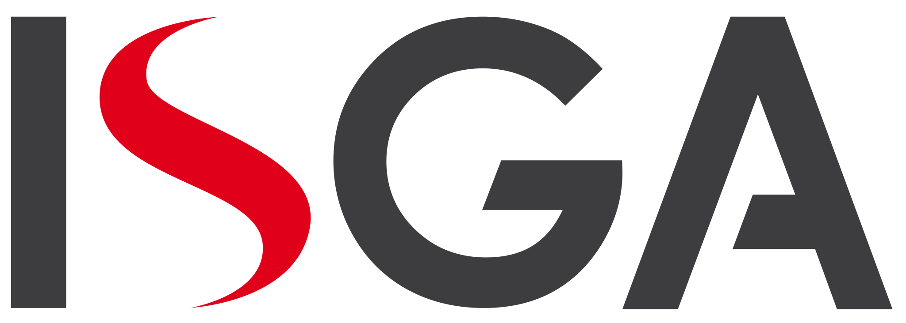

<!-- Personnal Banner -->

  

Specializing in .NET and modern JavaScript/TypeScript technologies.  
I design, build, and deliver scalable solutions, leading projects from architecture to deployment.

---

## Connect with me

  
  
  

---

## Key Skills

### Backend

### Frontend

### Database & Data

### Cloud, DevOps & AI

### Methodologies & Architecture
-2496ED?logo=scrumalliance&logoColor=white)

---

## Education

   
  Engineer’s Degree in Information Systems – Software Engineering & Web Development 
  <em>2011 – 2016</em>

   
  Master’s Degree in Computer Science Applied to Business Management (MIAGE) 
  <em>2014 – 2015</em>

